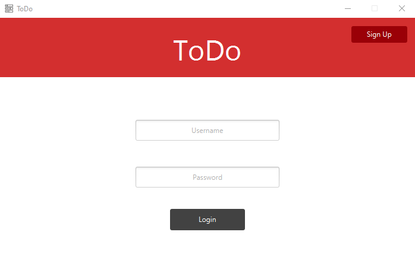
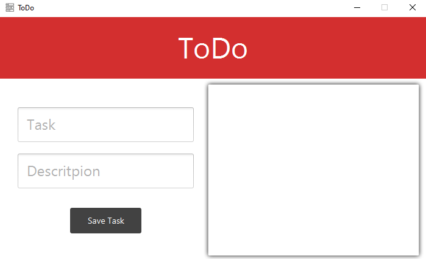
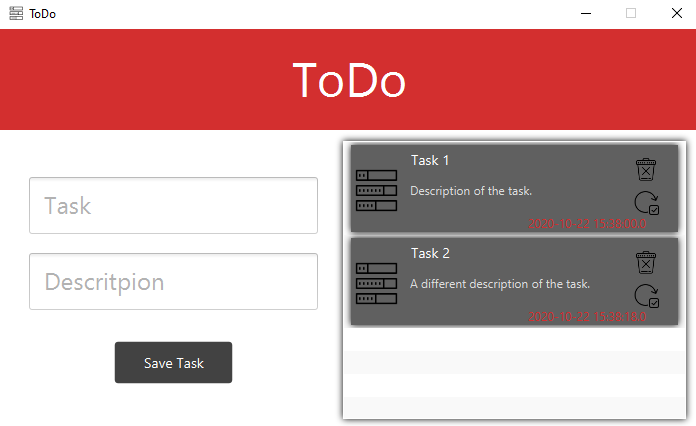

# ToDoApp
Basic To Do List App

## How to run
First download the code.  
Then setup the database so the program can save users' details and activities ([Here](https://www.vogella.com/tutorials/MySQLJava/article.html) is a tutorial on how to do that).  
You will need to change the details for accessing the database in DatabaseHandler class.  
Now run the application by either compiling it to an executable or using your preferred IDE.

## How to use
### Logging in
&nbsp;&nbsp;&nbsp;&nbsp;The first screen you will be presented with is the login screen (see below). This allows you to enter your saved details so you can view your activities. If you don't have an account, you can create one by clicking the "Sign Up" button. (All accounts are stored locally in the database you created).

### Making a to-do list
&nbsp;&nbsp;&nbsp;&nbsp;Once you have logged in, you will be presented with a list of activities (or a blank list if none have been set). To add activities, you can write a title and description in the relevant text boxes and click add. You can edit and delete the tasks created by clicking on the bin and refresh icons.

 
